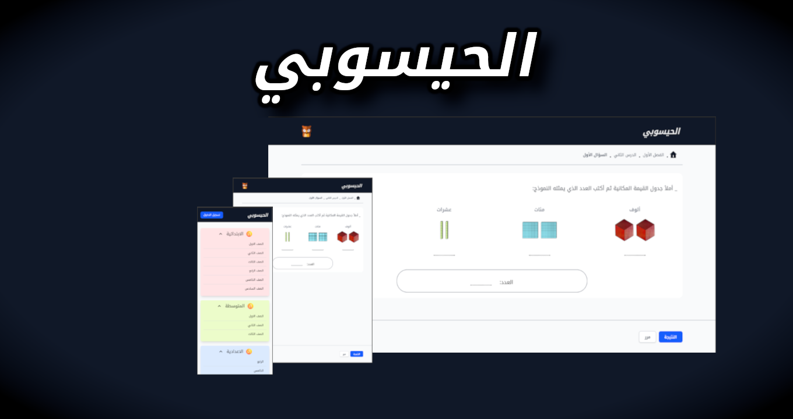

<h1 style="text-align:center;font-size:3rem">
  Hisouby ( الحيسوبي )
   
  <a 
    href="https://hisouby.web.app" 
    target="_blank"
    style="font-size:1.5rem"
  >
    https://hisouby.web.app
  </a>
</h1>

  <figure style="width:400px">
    
  </figure>

### Our comprehensive math web application is designed to guide students on their entire math journey. From foundational Primary School arithmetic to complex High School algebra and calculus.

### Built With

---

This project was built using these technologies.

- Nuxt.js ( SSR )
- TailwindCSS
- Pinia
- Vite

## Show your support

Give a ⭐ if you like this website!
